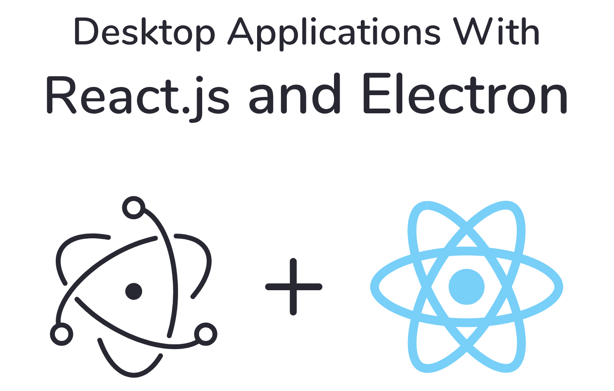
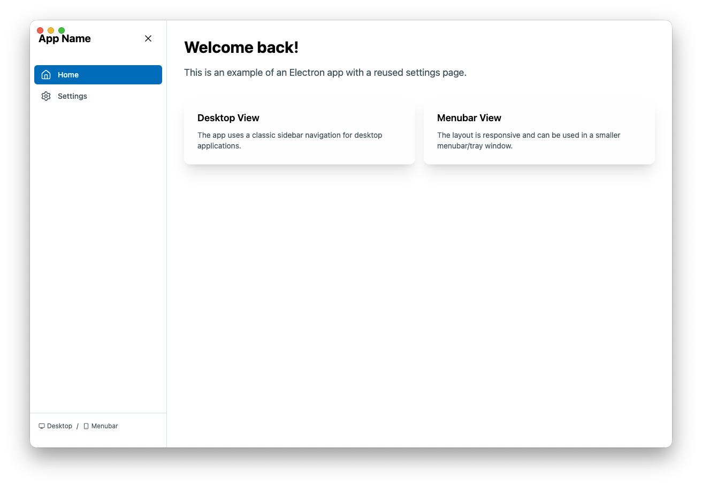
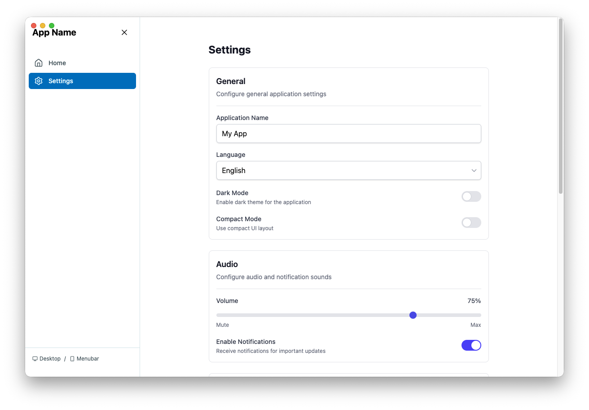

<div align="center">

</div>
<br />

# Electron React Boilerplate

A modern, feature-rich boilerplate for building cross-platform desktop applications with Electron, React, TypeScript, and Tailwind CSS.

[](https://github.com/your-username/electron-react-boilerplate)
[](LICENSE)

## ✨ Features

- 🚀 **Modern Stack**: React 18 + TypeScript + Vite + Tailwind CSS v4
- 🖥️ **Cross-Platform**: Windows, macOS, and Linux support
- 🎨 **Beautiful UI**: Pre-built settings page with reusable components
- 🧪 **Testing Ready**: Vitest + React Testing Library setup
- 📦 **Production Ready**: Optimized builds with Electron Builder
- 🔧 **Developer Experience**: Hot reload, ESLint, Prettier, Husky
- 🎯 **Type Safe**: Full TypeScript configuration

## 📸 Screenshots

<div align="center">
  
  
</div>

## 🚀 Quick Start

### Use This Template

1. Click the **"Use this template"** button above
2. Clone your new repository
3. Install dependencies and start developing:

```bash
npm install
npm run electron:dev
```

That's it! Your desktop app will open with hot reload enabled.

## 📁 Project Structure

```
electron-react-boilerplate/
├── electron/                 # Electron main process
│   ├── main.ts              # Main entry point
│   └── preload/             # Preload scripts
├── src/                     # React renderer process
│   ├── components/          # Reusable UI components
│   │   ├── ui/             # Base UI components
│   │   └── layout/         # Layout components
│   ├── pages/              # Application pages
│   ├── hooks/              # Custom React hooks
│   ├── services/           # API and utility services
│   └── styles/             # Global styles and Tailwind config
├── assets/                  # Static assets (images, icons)
├── public/                  # Public static files
└── build/                   # Built application output
```

## 🛠️ Available Scripts

```bash
# Development
npm run electron:dev          # Start development with hot reload
npm run start                 # Start Vite dev server only
npm run build                 # Build for production

# Production
npm run electron:build        # Build and package for current platform
npm run electron:dist         # Create distributable package

# Testing
npm run test                  # Run tests with Vitest
npm run test:ui              # Run tests with UI

# Code Quality
npm run lint                  # Run ESLint
npm run lint:fix             # Fix ESLint issues
npm run format               # Format code with Prettier
```

## 🎨 UI Components

This boilerplate includes a comprehensive set of reusable UI components:

### Form Components
- **Input** - Text input with validation
- **TextArea** - Multi-line text input
- **Select** - Dropdown selection
- **Checkbox** - Boolean toggle
- **Slider** - Range input with labels
- **RadioGroup** - Mutually exclusive options
- **FormField** - Form field wrapper with labels and errors

### Layout Components
- **Card** - Content container with header/footer
- **Button** - Action buttons with variants
- **Toggle** - Switch component

All components are fully typed, accessible, and styled with Tailwind CSS.

## 🔧 Configuration

### TypeScript
The project uses strict TypeScript configuration. Path aliases are set up:
- `@/*` maps to `src/*`

### Tailwind CSS v4
Modern Tailwind configuration with:
- CSS custom properties for theming
- Responsive design utilities
- Dark mode support
- Custom component classes

### Electron
- Main process with IPC communication
- Preload scripts for secure API exposure
- System tray support
- Production build optimization

## 🧪 Testing

Tests are configured with Vitest and React Testing Library:

```bash
npm run test          # Run all tests
npm run test:watch    # Watch mode
npm run test:coverage # Coverage report
```

## 📦 Building for Production

### For Development Testing
```bash
npm run electron:build
```

### For Distribution
```bash
# macOS
npm run electron:dist

# Windows (on Windows)
npm run electron:dist-win

# Linux (on Linux)
npm run electron:dist-linux
```

The distributable packages will be created in the `dist/` folder.

## 🎯 Usage Examples

### Using UI Components

```tsx
import { Card, CardHeader, CardTitle, CardContent } from '@/components/ui/Card';
import { Input } from '@/components/ui/Input';
import { Select } from '@/components/ui/Select';
import { Button } from '@/components/ui/Button';

function MyComponent() {
  return (
    <Card>
      <CardHeader>
        <CardTitle>My Settings</CardTitle>
      </CardHeader>
      <CardContent className="space-y-4">
        <Input
          label="Name"
          placeholder="Enter your name"
        />
        <Select
          label="Theme"
          options={[
            { label: 'Light', value: 'light' },
            { label: 'Dark', value: 'dark' }
          ]}
        />
        <Button>Save Settings</Button>
      </CardContent>
    </Card>
  );
}
```

### Local Storage Hook

```tsx
import useLocalStorage from '@/hooks/useLocalStorage';

function SettingsComponent() {
  const [theme, setTheme] = useLocalStorage('app-theme', 'light');
  const [notifications, setNotifications] = useLocalStorage('notifications', true);

  return (
    // Your component JSX
  );
}
```

## 🤝 Contributing

1. Fork the repository
2. Create a feature branch (`git checkout -b feature/amazing-feature`)
3. Commit your changes (`git commit -m 'Add amazing feature'`)
4. Push to the branch (`git push origin feature/amazing-feature`)
5. Open a Pull Request

## 📄 License

This project is licensed under the MIT License - see the [LICENSE](LICENSE) file for details.

## 🙏 Acknowledgments

- [Electron](https://electronjs.org/) - Cross-platform desktop app framework
- [React](https://reactjs.org/) - UI library
- [Vite](https://vitejs.dev/) - Fast build tool
- [Tailwind CSS](https://tailwindcss.com/) - Utility-first CSS framework
- [shadcn/ui](https://ui.shadcn.com/) - Beautiful UI components inspiration

---

<div align="center">
  <p>Built with ❤️ using Electron, React, and TypeScript</p>
  <p>
    <a href="#electron-react-boilerplate">Back to top</a>
  </p>
</div>