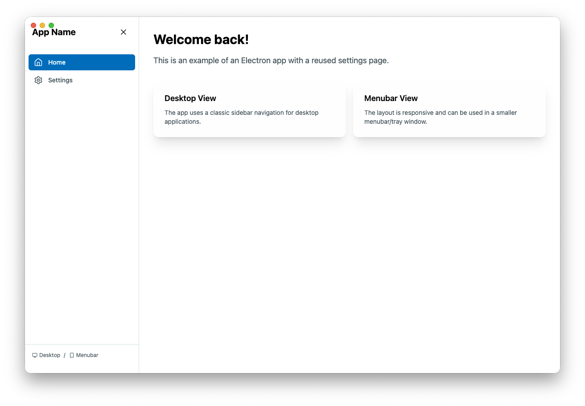
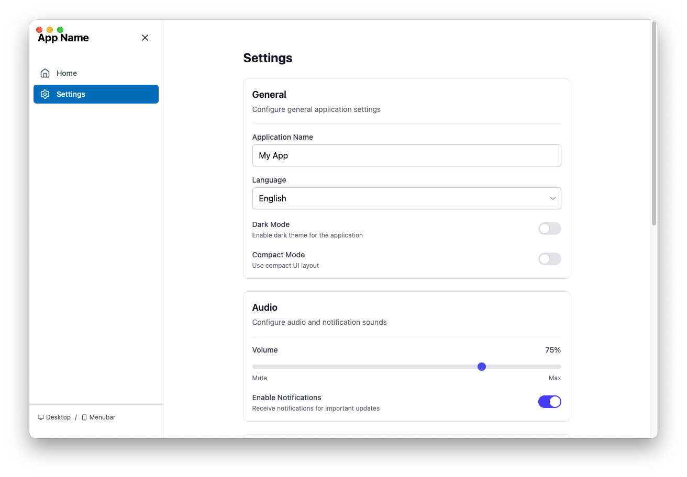

# Electron React Template

A minimal, production-ready template for building cross-platform desktop applications with Electron, React, TypeScript, and Tailwind CSS v4.

## Why This Exists

Most Electron boilerplates are bloated with opinions you don't need. This template provides only the essentials: a working build pipeline, type-safe IPC, and a component system you can actually extend. Everything else is your decision.

## Preview




## Quick Start

```bash
# 1. Clone and install
git clone https://github.com/romankurnovskii/electron-react-template my-app
cd my-app
npm ci

# 2. Develop with hot reload
npm run electron:dev

# 3. Build for production
npm run electron:dist
```

## Project Structure

```
electron-react-template/
├── electron/                 # Electron main process
│   ├── main.ts              # App entry point, window management, IPC handlers
│   └── preload/             # Secure context bridge (exposes APIs to renderer)
├── src/                     # React renderer process
│   ├── components/          # Reusable UI components
│   │   ├── ui/             # Base primitives (Button, Input, Card, etc.)
│   │   └── layout/         # Layout components (Sidebar, Header, etc.)
│   ├── pages/              # Route-level components
│   ├── hooks/              # Custom React hooks
│   ├── services/           # Business logic, API clients
│   ├── styles/             # Global styles, Tailwind imports
│   └── __tests__/          # Unit/integration tests
├── assets/                  # Static assets (icons, images)
├── public/                  # Public files copied to build/
├── build/                   # Compiled output (gitignored)
└── dist/                    # Packaged distributables (gitignored)
```

## Commands

| Command | Description |
|---------|-------------|
| `npm run electron:dev` | Start dev server + Electron with hot reload |
| `npm run start` | Vite dev server only (renderer) |
| `npm run build` | Type-check + production build (renderer) |
| `npm run electron:build` | Build + package for current platform |
| `npm run electron:dist` | Create distributable (macOS: `--mac --dir`) |
| `npm run test` | Run Vitest tests (headless) |
| `npm run test:ui` | Run tests with Vitest UI |
| `npm run lint` | ESLint check |
| `npm run lint:fix` | Auto-fix lint issues |
| `npm run format` | Prettier format |

## Architecture

### TypeScript
- Strict mode enabled
- Path alias: `@/*` → `src/*`
- Separate configs for renderer (`tsconfig.json`) and main (`electron/tsconfig.json`)

### Renderer (React + Vite)
- React 19 with TypeScript
- Tailwind CSS v4 (CSS-first config)
- Vitest + React Testing Library
- ESLint 9 + typescript-eslint + Prettier

### Main Process (Electron)
- Electron 43 + TypeScript (CommonJS output)
- Secure IPC via contextBridge in preload
- electron-builder for packaging

### IPC Pattern
```typescript
// electron/preload/index.ts
contextBridge.exposeInMainWorld('api', {
  getSettings: () => ipcRenderer.invoke('settings:get'),
  saveSettings: (s) => ipcRenderer.invoke('settings:save', s),
});

// src/services/api.ts
export const api = {
  getSettings: () => window.api.getSettings(),
  saveSettings: (s) => window.api.saveSettings(s),
};
```

## UI Components

Located in `src/components/ui/`. Each component:
- Is fully typed with TypeScript
- Uses Tailwind for styling
- Follows Radix UI patterns (composable, accessible)

```tsx
import { Button } from '@/components/ui/Button';
import { Input } from '@/components/ui/Input';
import { Card, CardHeader, CardTitle, CardContent } from '@/components/ui/Card';

function SettingsPanel() {
  return (
    <Card>
      <CardHeader><CardTitle>Settings</CardTitle></CardHeader>
      <CardContent className="space-y-4">
        <Input label="API Key" placeholder="sk-..." />
        <Button>Save</Button>
      </CardContent>
    </Card>
  );
}
```

## Testing

```bash
npm run test           # Run once (CI mode)
npm run test:watch     # Watch mode
npm run test:coverage  # Coverage report
```

Tests live in `src/__tests__/` alongside source files.

## Building for Distribution

```bash
# macOS (universal)
npm run electron:dist

# Windows (run on Windows)
npm run electron:build -- --win

# Linux (run on Linux)
npm run electron:build -- --linux
```

Output appears in `dist/`.

## AI Agent Prompt

Copy this prompt when starting a new project from this template:

---

**Prompt for AI Agent:**

> Clone `https://github.com/romankurnovskii/electron-react-template.git` and build a desktop app from it: a simple dashboard showing public metrics like CPU usage and active users.

---

